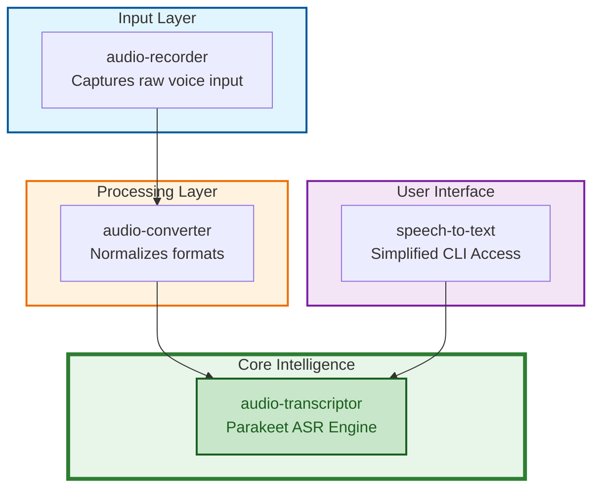

# python-speech-to-text-parakeet

A focused command-line toolkit for **recording audio**, **converting audio**, and
**transcribing speech to text** using NVIDIA Parakeet (NeMo).

It exposes three CLIs:

- `audio-recorder` — capture microphone input (WAV/MP3/FLAC/MP4/OGG).
- `audio-converter` — convert audio files between OGG / MP3 / WAV / FLAC / MP4 via FFmpeg.
- `speech-to-text` (alias: `audio-transcriptor`) — transcribe audio files or live recordings using Parakeet.

## System Architecture



## Prerequisites


- Python **3.13+**
- [`uv`](https://docs.astral.sh/uv/) for dependency / tool management
- **FFmpeg** available on `PATH` (required by `audio-converter` and by `speech-to-text` for non-native inputs)
- **CMake** on `PATH` (`brew install cmake`) — needed when `uv sync` builds
  `kaldialign==0.8.0` from source on macOS arm64 (no prebuilt wheel for 3.13).

## Quick start (onboarding)

For a typical macOS setup, the shortest path from clone to dictation is:

```bash
# 1. Clone and enter the project
git clone <repo-url> python-speech-to-text-parakeet
cd python-speech-to-text-parakeet

# 2. Install system prerequisites (Homebrew shown)
brew install ffmpeg cmake libsndfile terminal-notifier

# 3. Sync Python dependencies (kaldialign builds from source on arm64)
CMAKE_POLICY_VERSION_MINIMUM=3.5 uv sync

# 4. Smoke-test the CLI (downloads the Parakeet model on first run)
uv run speech-to-text --record --cleanup all

# 5. (Optional, recommended) Install globally and wire up zsh helpers
uv tool install . --editable --prerelease=allow
bin/setup-stt-zsh.sh install   # adds dictate-stt / transscribe-stt to ~/.zshrc
exec zsh                       # reload shell
dictate-stt                    # speak → transcript on clipboard + notification
```

## Installation

### Run from within the repository
```bash
# macOS arm64 / Python 3.13: kaldialign's vendored pybind11 needs an older
# CMake policy. Export this once for the initial sync; subsequent runs
# don't need it.
CMAKE_POLICY_VERSION_MINIMUM=3.5 uv sync
uv run speech-to-text --help
```

### Install as a global tool
```bash
uv tool install /path/to/python-speech-to-text-parakeet --editable --prerelease=allow
speech-to-text --help
```

### Run from outside the repository
```bash
uv run --project /path/to/python-speech-to-text-parakeet speech-to-text
```

## `speech-to-text`

Transcribe individual files, whole folders, or live recordings.

```bash
# Transcribe a single file
speech-to-text my_audio.mp3

# Transcribe all audio files in a folder recursively
speech-to-text ./my_audio_folder --recursive

# Record and transcribe immediately
speech-to-text --record

# Just speak and get text, keep no files
speech-to-text --record --cleanup all
```

### Options
- `path`: (Optional) Audio file or directory.
- `--recursive`: Walk folders recursively.
- `--record`: Capture live audio via the recorder module, then transcribe.
- `--cleanup`: Comma-separated items to delete after processing (`audio`, `transcription`, `all`).
- `--format`: Output extension (`txt` or `md`, default `txt`).
- `--output-dir`: Custom directory for transcriptions; folder structure is mirrored.
- `--model`: Transcription model (default: `nvidia/parakeet-tdt-0.6b-v3` / env `STT_MODEL`).
- `--provider`: Transcription provider (default: `parakeet` / env `STT_PROVIDER`).
- `--no-skip`: Re-transcribe even if the output already exists.
- `--list-providers`: Print the transcription providers registered in this build and exit.

Input formats that are not natively supported by the active provider
(Parakeet: `wav`, `flac`, `ogg`, `mp3`) are automatically normalized via the
`audio-converter` module. The pre-conversion target defaults to FLAC
(set via `STT_PRECONVERSION_FORMAT`).

### Model, device, and cache

- **Model:** [`nvidia/parakeet-tdt-0.6b-v3`](https://huggingface.co/nvidia/parakeet-tdt-0.6b-v3)
  (~0.6 B params). Released under **CC-BY-4.0** — attribute NVIDIA when
  redistributing transcripts at scale.
- **Device selection:** `STT_DEVICE` wins if set; otherwise `mps` is used
  when `torch.backends.mps.is_available()`, else `cpu`.
- **Cache:** the model is fetched via Hugging Face Hub on first run and
  cached under `~/.cache/huggingface/hub/` (override with `HF_HOME`).
  Expect a multi-hundred-MB download on first launch.

### Troubleshooting

- **`libsndfile` cannot read MP3:** ensure `libsndfile ≥ 1.1`
  (`brew upgrade libsndfile`). Older builds silently lack MP3 support;
  `soundfile.info("foo.mp3")` will fail.
- **MPS hiccups:** if Parakeet errors out on Apple Silicon GPU, force
  CPU with `STT_DEVICE=cpu`. MPS is fastest but occasionally trips on
  unsupported NeMo ops.
- **`kaldialign` build fails:** install CMake (`brew install cmake`) and
  re-run with `CMAKE_POLICY_VERSION_MINIMUM=3.5 uv sync`.

## Shell helpers — quick dictation from zsh

The [`bin/setup-stt-zsh.sh`](bin/setup-stt-zsh.sh) script registers a handful
of zsh functions that wrap `speech-to-text` with sensible defaults so you can
dictate into any application with a single command. These are the killer
feature of the project — once installed, you press one key, talk, and the
transcript lands on your clipboard with a desktop notification.

### Install / uninstall
```bash
bin/setup-stt-zsh.sh install     # write snippet + source it from ~/.zshrc
bin/setup-stt-zsh.sh status      # check whether currently installed
bin/setup-stt-zsh.sh uninstall   # remove the managed block again
```

The install step is idempotent: it writes a self-contained snippet to
`~/.config/python-speech-to-text-parakeet/stt.zsh` and sources it from
`~/.zshrc` inside a marked `# >>> python-speech-to-text-parakeet stt >>>`
block, so re-running `install` or `uninstall` never touches unrelated lines.
Requires `speech-to-text` (or its `speech-to-text-modern` alias) to be on
`PATH` — typically via `uv tool install . --editable --prerelease=allow`.

### Available commands
| Command | What it does |
|---|---|
| `dictate-stt` | Record → transcribe → copy to clipboard → notify; delete both audio and transcript afterwards. |
| `dictate-stt-md` | Same, but keep the generated `.md` transcript (deletes only the audio). |
| `dictate-stt-audio` | Same, but keep the audio recording (deletes the transcript). |
| `dictate-stt-all` | Keep both audio and markdown transcript. |
| `transscribe-stt <path>` | Transcribe a file or folder to markdown (`--no-skip`, notifies when done). |

All commands forward extra flags to `speech-to-text`, so e.g.
`dictate-stt --output-dir ~/notes` works as expected, and tab-completion
for flags is registered automatically.

### Usage examples
```bash
# Press Enter, speak, press Enter — transcript is on your clipboard.
dictate-stt

# Dictate and also keep the markdown file in the current directory.
dictate-stt-md

# Bulk-transcribe a folder of recordings to markdown next to each source file.
transscribe-stt ~/recordings/2026-meetings
```

## `audio-recorder`

```bash
# Timestamped FLAC (default; overridable via RECORD_AUDIO_DEFAULT_FORMAT)
audio-recorder

# Specific filename (format inferred from extension)
audio-recorder my_meeting.mp3

# Force a format
audio-recorder --format flac
```

### Options
- `filename`: (Optional) Output filename. Defaults to a timestamped file.
- `--format`: `wav`, `mp3`, `flac`, `mp4`, `ogg`.
- `--samplerate`: Default `44100`.
- `--channels`: Default `1`.

### Controls during recording
- **Space**: Pause / Resume.
- **Enter**: Stop and save.

## `audio-converter`

Convert files or whole folders between OGG / MP3 / WAV / FLAC / MP4.

```bash
# Explicit input and output
audio-converter input.wav output.mp3

# Lazy conversion (output name inferred)
audio-converter input.wav --to mp3

# Bulk folder conversion
audio-converter --input-folder ./raw --output-folder ./converted --from wav --to mp3

# Recursive
audio-converter --input-folder ./archive --recursive --from flac --to ogg
```

### Options
- `input`, `output`: (Optional) Single-file paths.
- `--input-folder`, `--output-folder`: Bulk mode.
- `--recursive`: Recurse into subdirectories.
- `--from`, `--to`: Source / target format (required for bulk mode).
- `--list`: List supported formats.
- `--ask-overwrite`: Prompt before overwriting existing files.

## Configuration

Settings are loaded from environment variables (optionally from a `.env` file).
See `src/audio/core/config.py` for the full list. Prefixes:

- `RECORD_AUDIO_*` — recorder defaults (format, samplerate, channels, date format).
- `AUDIO_CONVERTER_*` — converter defaults (e.g. `AUDIO_CONVERTER_ASK_ON_OVERWRITE`).
- `STT_*` — Speech-to-text defaults (`STT_PROVIDER`, `STT_MODEL`, `STT_DEVICE`, `STT_PRECONVERSION_FORMAT`).

## Project layout

```
.
├── README.md
├── pyproject.toml
├── uv.lock
├── bin/                      # shell integrations (setup-stt-zsh.sh)
├── src/
│   └── audio/
│       ├── core/             # AudioFormat, Settings
│       ├── recorder/         # mic capture + audio-recorder CLI
│       ├── converter/        # ffmpeg conversion + audio-converter CLI
│       └── transcriptor/     # Parakeet STT + speech-to-text CLI
└── tests/
    ├── unit/
    │   ├── record_audio/
    │   ├── audio_converter/
    │   ├── speech_to_text/
    │   └── test_helper.py
    └── integration/
```
